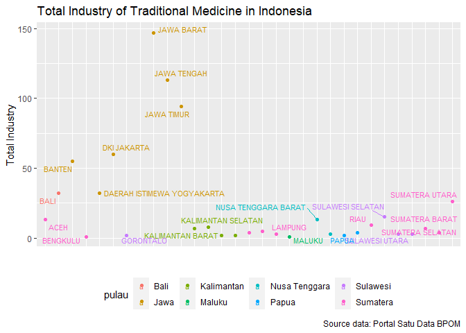
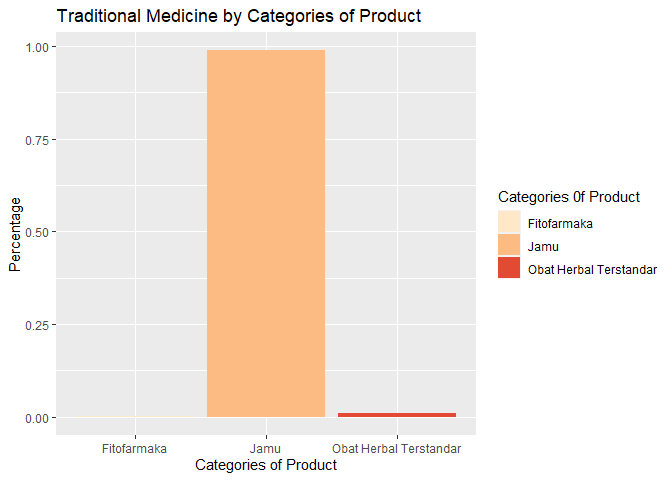

Traditional Medicine Industry in Indonesia
================
Nathasya Pramudita
2023-08-01

------------------------------------------------------------------------

# About dataset

This dataset is came from [portal satu data
BPOM](https://satudata.pom.go.id/datasets). It’s an open source dataset
from Indonesia government in Foods and Drugs administration sector. The
data is from *2021-10-01*.

My focus of this project is finding important key about **Traditional
Medicine Industries in Indonesia**. The dataset is about:

| Data Frame                    | Information                                                                                                                                                           |
|-------------------------------|-----------------------------------------------------------------------------------------------------------------------------------------------------------------------|
| total_industry_and_registrant | Consist of 31 observant and 5 variables. It’s about total and how much industries that want to register as Traditional Medicine manufacturer by Province in Indonesia |
| categories_industry           | 3 observant and 2 variables. Consist of the type of industry and total of each type of that industry                                                                  |
| total_prouct_by_categories    | 3 observant and 2 variables. Consist of the categories of product and total of each product                                                                           |
| percentage_import_export      | With 3 observant and 3 variables that consist of total product of export and import, and percentage each sale                                                         |

# Total registrant and Industry of Traditional Medicine in Indonesia

``` r
# Number of Registrant Manufacture of Traditional Medicine in Indonesia

total_industry_and_registered %>%
  ggplot(aes(x=provinsi, y=jumlah_pendaftar, color=pulau, label=provinsi))+
  geom_point()+
  labs(title="Number of Traditional Medicine Product Registrar by Province",
       caption = "Source data: Portal Satu Data BPOM",
       x="",
       y="Total Industry",
       fill="Pulau: ")+
  theme(axis.text.x=element_blank(),
      axis.ticks.x=element_blank())+
  geom_text_repel(size=3)+
  theme(legend.position="bottom")
```

<!-- -->

``` r
# Total Number Traditional Medicine Factory in Indonesia
total_industry_and_registered %>%
  ggplot(aes(x=provinsi, y=jumlah_industri, color=pulau, label=provinsi))+
  geom_point()+
  labs(title="Total Industry of Traditional Medicine in Indonesia",
       caption = "Source data: Portal Satu Data BPOM",
       x="",
       y="Total Industry")+
  theme(axis.text.x=element_blank(),
        axis.ticks.x=element_blank())+
  geom_text_repel(size=3)+
  theme(legend.position="bottom")
```

<!-- -->

# Percentage of Import, Export, and Local production of Traditional Medicine in Indonesia

``` r
percentage_import_export %>%
  ggplot(aes(x="", percentage, fill=product_type))+
  geom_bar(stat="identity", color="white")+
  coord_polar("y", start=0)+
  geom_text(aes(label=paste0(round(percentage*100), "%")),
            position=position_stack(vjust=0.5))+
  labs(title="Percentage of Traditional Medicine Industry by Market")+
  theme(axis.title = element_blank(),
        axis.text = element_blank(),
        axis.ticks = element_blank(),
        panel.grid = element_blank(),
        panel.border = element_blank())+
  scale_fill_brewer(palette = "green", name = "Producing For")
```

<!-- -->

# Categories of Traditional Medicine in Indonesia

``` r
catagories_industry %>%
  ggplot(aes(jenis_industri, jumlah_industri, fill=jenis_industri))+
  geom_col()+
  labs(title="Categories of Traditional Medicine Industry",
       subtitle = "Based on Industries Type",
       caption="Source: Portal Satu Data BPOM",
       x="Industry Type",
       y= "Total Industry",
       fill="Industry Categoriest: ")+
  theme(legend.position = "bottom")+
  scale_fill_brewer(palette="PuBu")+
  theme_linedraw()
```

<!-- -->

Information table
`Catagories of Traditional Medicine Industry Based on Industry Type`:

- IOT = Industri Obat Tradisional
- UKOT = Usaha Kecil Obat Tradisional
- UMOT = Usaha Mikro Obat Tradisional

# Traditional Medicine by Categories of Product

``` r
total_product_by_categories %>%
  mutate("percentage_cat" = jumlah_produk / sum(jumlah_produk)) %>%
  ggplot(aes(kategori_produk, percentage_cat, fill=kategori_produk))+
  geom_col()+
  labs(title="Traditional Medicine by Categories of Product",
       x="Categories of Product",
       y="Percentage",
       fill="Categories 0f Product")+
  theme(legend.position = "bottom")+
  scale_fill_brewer(palette="OrRd")+
  theme_gray()
```

<!-- -->

------------------------------------------------------------------------
